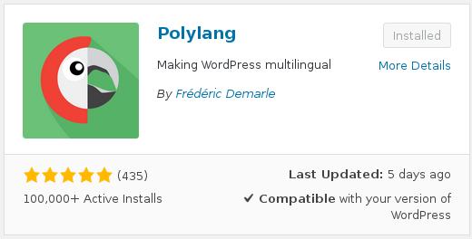
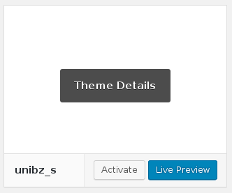

# Documentation for developers #

This guide explains how to install this theme. We assume a fresh installation
of Wordpress has already happened.

---

## 1. Install plugin Polylang ##

Log into the CMS, go to the plugin page, search and install Polylang

## 2. Download source ##

Go to the folder where your Wordpress isntance has been isntalled and clone 
this repository to the `wp-content/themes` subfolder

~~~
$ git clone https://github.com/leonixyz/wp-unibz.git /var/www/wordpress/wp-content/themes
~~~

## 3. Enable theme ##

Open the themes page and enable the theme

---

It could be that you have to log out and in again for applying all changes.
