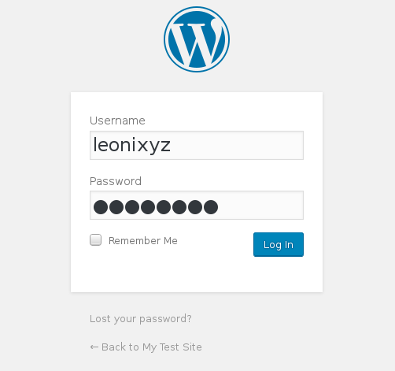
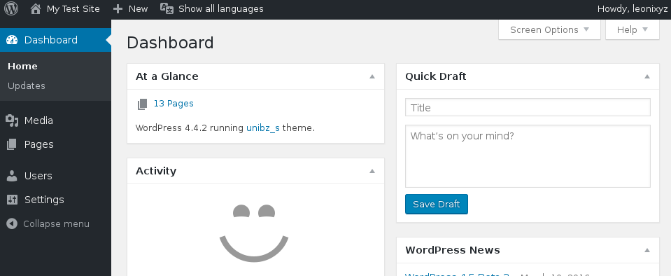
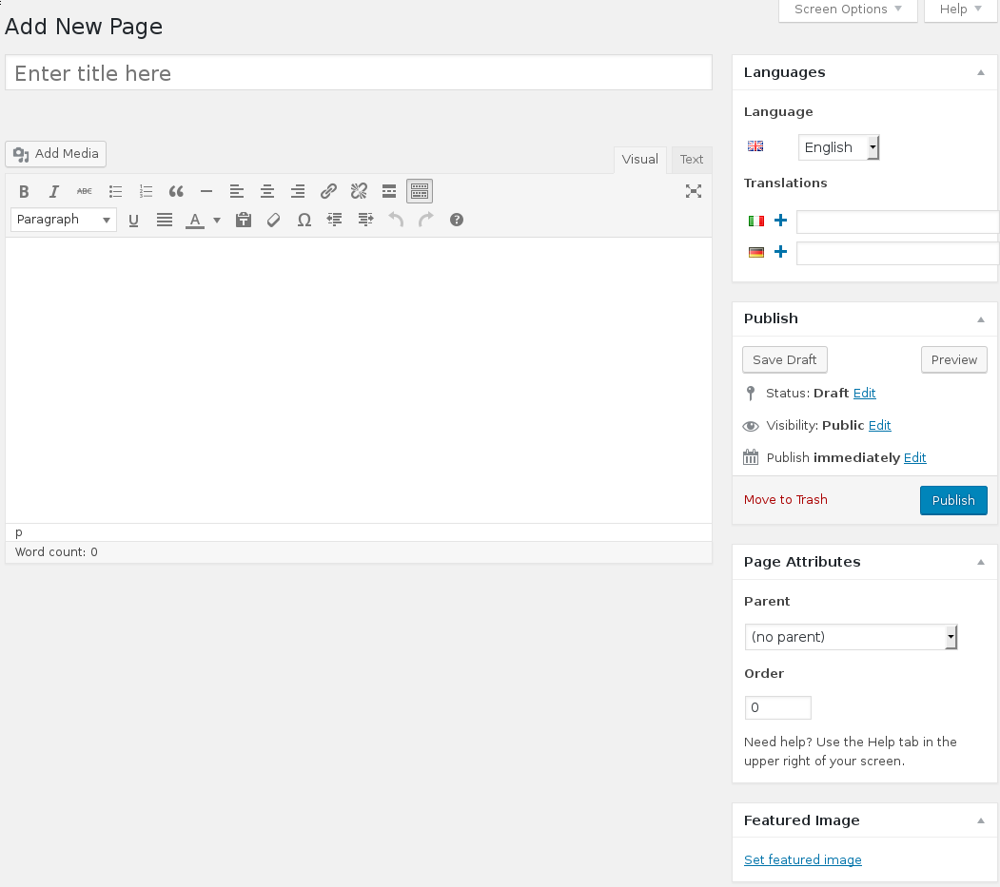
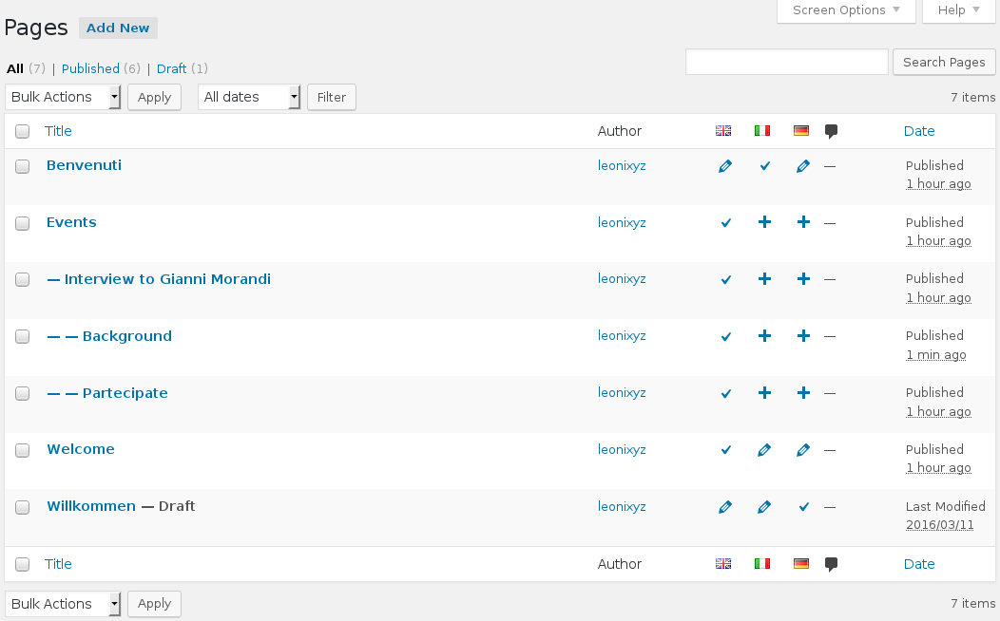
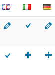
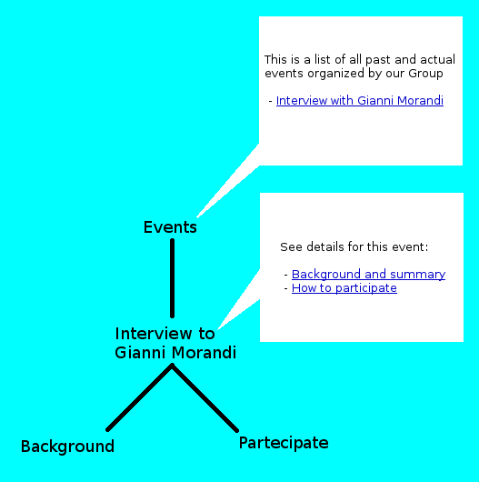

# Documentation for editors #

Wordpress usually lets users publish several types of contents (i.e. posts, 
comments, static pages, etc). This theme was restricted in order to only allow
static pages. A page is a container for whatever content you like: text, images,
links, etc. In this tutorial we will see how to publish a page and how to manage 
our Wordpress instance. From this point on, we will assume you have already been 
provided with the URL of your Wordpress instance (e.g.
http://www.exaple.com/path/to/wordpress ) and your credentials (username/passord)
for the administration area.

---

## Tutorial ##

### 1. Page creation ###

Open the URL of your Wordpress instance with a web browser, ignore errors 
complaining that the content cannot be found (in fact you have yet no content
to show at all), scroll to the very bottom of the page and click on "Log in".
Enter your credentials.

You will be redirected to the Dashboard, the administration area for your site.

Move your mouse pointer on `+ New` on the top bar and then select `Page` from 
the dropdown menu.

Start inserting your content into the form, we assume you are already familiar
with such kind of interface. You can enter text, format it, embed images, links,
etc. When you are done click on `Publish`. You can also save a draft and publish
it in a second moment.

Some interesting features to take into account are **Languages** and **Page 
Attributes**.

 * A single page could have multiple versions, depending on how many languages has
   been translated to. It can also be available only in one language, but in 
   this case it will be **hidden** to all users that have choosen to browse
   your webpage using a different language. To workaround this, supposing you are
   editing the german section of your site, and want to provide a way for the user
   to visit a particular english page that has not been translated, create a link
   in one of your german pages to redirect directly to the english page.
   This will switch the user's localisation option to english, therefore you are 
   really invited to translate all your pages to avoid this kind of problems.

 * By setting a **Parent** for a page, you tell Wordpress to nest the current page
   under the parent you provide. In this way you can easily create some form of
   tree-like structure, having an arbitrary organization of your contents.
   **No parent** means that the current page is the root of the tree. This tree
   structure is used for building the menu: parent pages will have dropdown
   submenus containing their children pages. Parent pages will also be shown
   **only in the menu**, so don't spend any time at all filling them with
   content. We will come back to this point at the end of this tutorial, to
   provide a way for everyone to reach all pages of your website, including
   search engines or crawlers with Javascript disabled.

### 2. Page administration ###

If we choose `Pages` --> `All Pages` from the Dashboard, we can see all our
pages, including drafts, and have an overview of the tree structures that have
been built.

For example, from the picture above we can see that `Events` has `Interview to
Gianni Morandi` as child, which in turn is parent for `Background` and
`Participate`.

This structure suggests that the event `Interview to Gianni
Morandi` is explained in its `Background` page, and details about how to
participate are described in `Participate` page.

Moreover, we can see that there are three pages left: `Benvenuti`, `Welcome`
and `Willkommen`. It is easy to note that these are just three versions of
the same page in different languages, but unfortunately Wordpress threat them as
separate objects and the only way we have to know they are linked together is by
looking at their language attributes:

 * The check mark indicates that a particular page is available in that specific
   language.
 * The pencil indicates that the same page has also been translated to another
   language.
 * The plus sign indicates that the current page has not been yet translated to
   that language.

By clicking on those icons we can, in order:

 * Edit the current page.
 * Edit the current page in the given language.
 * Add a new version of that page in the given language.

### 3. Tips and tricks ###

We said before that pages with children are only shown in the menu, and hopefully
you didn't include any content in them. Some very particular users, however, are
not able to see the submenus due to the fact of their web browser lacking 
Javascript. Noticeable examples are 
[web-crawlers](https://en.wikipedia.org/wiki/Web_crawler) that we definetely
**doesn't want** to keep away from our content. For that reason we want that
any page can be accessed in some way from the website.

A naive solution would be to create a new page, called `Site Map`, put it at the
root level of our menu, and listing inside all other pages providing a link to
them.

This approach is not very handy, a better one would be to insert some very basic
content into parent pages. If a user browses your website without Javascript 
support, by clicking on the root level of the menu he/she is redirected to the
the actual page instead of opening its relative submenu.

For this reason, it is advised to fill parent pages with (at least) links to their
children. An example is give below:

